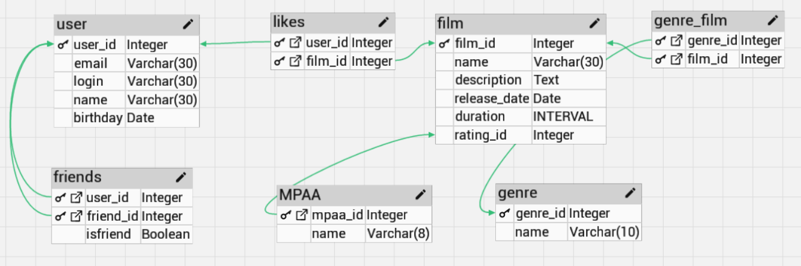

# java-filmorate
Template repository for Filmorate project.

Примеры запросов к БД:

Получить всех пользователей:
SELECT * from user
left join friends on (id = user_id)

Получить пользователя по идентефикатоу
SELECT * from user
left join friends on (id = user_id)
where id = N

Получить фильм по идентификатору:
SELECT * FROM film where id =  N

Получить первые N самых популярных фильмов
select * , count(user_id) from film 
right join likes on (id = film_id)
group by film_id
order by 2 desc
limit N 